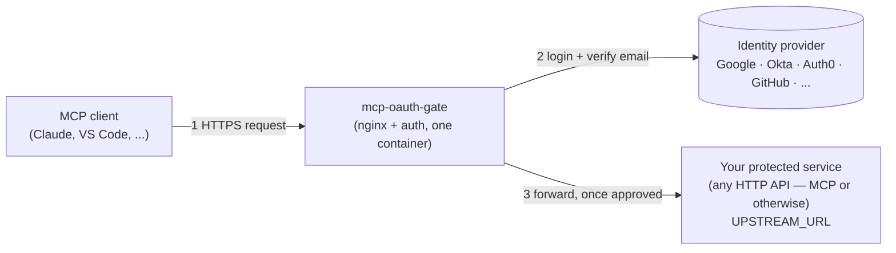
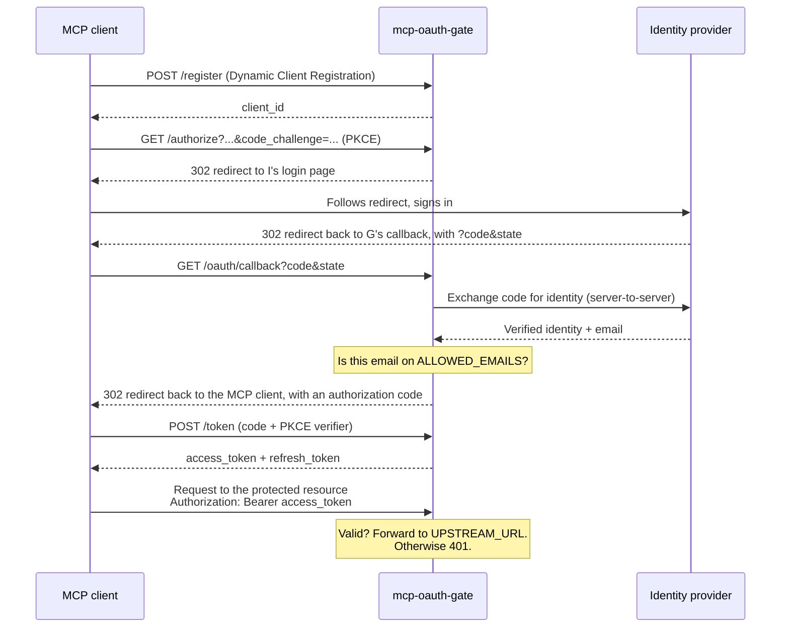

# mcp-oauth-gate

**Put spec-compliant OAuth 2.1 protection in front of any HTTP
service — MCP server or not — without changing a line of that service's
code.**

`mcp-oauth-gate` is a small, self-hostable authorization server that sits
directly in front of your existing service and handles login, tokens, and
access control for you — so tools like Claude, VS Code, or any other MCP
client can connect with a real "Sign in with Google" (or GitHub, Okta,
Auth0, Keycloak, ...) flow instead of a static bearer token pasted into a
config file. One container to run; no separate reverse proxy to configure.

## The problem this solves

Most self-hosted MCP servers ship with one of two options:

- **No auth at all** — fine on localhost, a liability the moment it's
  reachable from anywhere else.
- **A single static bearer token** — better than nothing, but it's one
  shared secret: no per-device revocation, no expiry, no "who actually
  used this."

Full multi-tenant identity platforms (`oauth2-proxy` and friends) solve
this properly, but they're built for "any number of unrelated users
logging into unrelated apps." If what you actually want is **"let me, and
only me, in — from any of my devices, with a real login screen"**,
that's a lot of machinery for a small job.

`mcp-oauth-gate` is the missing middle: spec-compliant OAuth 2.1
(discovery, Dynamic Client Registration, PKCE, rotating refresh tokens),
gated by a flat allowlist of your own email addresses, checked against an
identity provider you already trust. Single-tenant by design, not
something you grow into by accident.

> Not a competitor to [`oauth2-proxy`](https://github.com/oauth2-proxy/oauth2-proxy) —
> that project is a decade of hardening across thousands of multi-tenant
> deployments. This is a smaller, more opinionated tool for a narrower job.

## How it fits together

`mcp-oauth-gate` bundles nginx internally and reverse-proxies to your
service itself — there's no second container, and no nginx.conf to write.
Point `UPSTREAM_URL` at your service, and every request either gets
checked against a valid token and forwarded, or redirected into the login
flow.



## What actually happens when a client connects

The first time an MCP client connects, it registers itself, sends the
user through a real login screen, and exchanges the result for a token —
all standard OAuth 2.1, so any MCP client that already speaks OAuth just
works.



This authorization-code flow's access token expires after 1 hour by
default; the client silently exchanges its refresh token for a new pair
before then — no re-login. Every refresh rotates the token and revokes the
old one; if a spent refresh token is ever replayed, the entire chain
descended from that login is revoked immediately, not just the reused
token.

There's also a device-code flow for clients that don't speak OAuth
discovery — the same "go to this URL, enter this code" pattern as
`gh auth login`. It isn't advertised in the discovery metadata (only
`authorization_code` and `refresh_token` are), so a client has to already
know about `/device/code` and `/device/token` rather than discovering it
automatically. Its tokens also behave differently: they don't expire and
there's no refresh token — revoke one by hand if a device is compromised
(against the running container, so it hits the actual database rather
than an unrelated local file):

```sh
docker exec <container-name> node dist/scripts/tokens.js list
docker exec <container-name> node dist/scripts/tokens.js revoke <id>
```

## Is this the right tool?

|                                                         | No auth | Static bearer token | **mcp-oauth-gate** | `oauth2-proxy` |
| ------------------------------------------------------- | ------- | ------------------- | ------------------ | -------------- |
| Real login (not a shared secret)                        | ❌      | ❌                  | ✅                 | ✅             |
| Per-device tokens, individually revocable               | ❌      | ❌                  | ✅                 | ✅             |
| Works with any OIDC provider or GitHub                  | —       | —                   | ✅                 | ✅             |
| MCP-native (OAuth discovery, DCR, device-code fallback) | —       | —                   | ✅                 | ❌             |
| Multi-tenant / per-user authorization                   | —       | —                   | ❌ (by design)     | ✅             |
| Setup effort                                            | none    | trivial             | **small**          | significant    |

If you need real multi-tenancy — different users with different
permissions — use `oauth2-proxy` or a full identity platform instead.
If you're protecting something that's yours, reached from more than one
device, and you want a real login instead of a token in an env var, this
is built for exactly that.

## Quickstart

The fastest way to see it working end to end is the bundled
[`examples/docker-compose`](./examples/docker-compose) stack: the gateway
and a placeholder protected service (`httpbin`) standing in for your real
one.

```sh
cd examples/docker-compose
cp .env.example .env   # fill in AUTH_PROVIDER, CLIENT_ID/SECRET, ALLOWED_EMAILS
docker compose up -d
```

An unauthenticated request to the protected resource is rejected with a
pointer to how to authenticate — this is what an MCP client's OAuth
discovery sees on first contact:

```console
$ curl -i http://localhost:8080/mcp
HTTP/1.1 401 Unauthorized
WWW-Authenticate: Bearer resource_metadata="http://localhost:8080/.well-known/oauth-protected-resource"
```

An MCP client that speaks OAuth discovery takes it from here on its own
(that's what the `resource_metadata` URL above is for). To sign in by hand
instead — the same device-code flow a CLI tool like `gh auth login` uses —
request a code and open the URL it gives you:

```console
$ curl -s -X POST http://localhost:8080/device/code
{"device_code":"...","user_code":"F6DP-Y74K","verification_uri_complete":"http://localhost:8080/device?user_code=F6DP-Y74K", ...}
```

Open `verification_uri_complete` in a browser and sign in through your
identity provider. Meanwhile, poll for the token with the `device_code`
from that response — this returns `{"error":"authorization_pending"}`
until you approve it in the browser, then an access token:

```console
$ curl -s -X POST http://localhost:8080/device/token -d '{"device_code":"..."}' -H 'Content-Type: application/json'
{"access_token":"...","token_type":"Bearer","device_name":"unnamed-device"}
```

That token is what makes a request to the protected resource succeed —
your real MCP server would answer at `/mcp`; the placeholder `httpbin` in
this quickstart doesn't implement that route, so hit one it does have to
see the 200 (the auth check applies identically either way, to any path):

```console
$ curl -i http://localhost:8080/get -H 'Authorization: Bearer <access_token>'
HTTP/1.1 200 OK
```

If you already have a reverse proxy in front for TLS termination or to
consolidate several services, see
[`docs/reverse-proxy.md`](./docs/reverse-proxy.md) — it's a plain reverse
proxy to this container, nothing gateway-specific to configure there.

## Running it yourself

Copy `.env.example` to `.env` and fill in:

| Variable                      | Description                                                                                                                                                        |
| ----------------------------- | ------------------------------------------------------------------------------------------------------------------------------------------------------------------ |
| `BASE_URL`                    | Public URL this gateway is reached at                                                                                                                              |
| `RESOURCE_URL`                | Canonical URI of the protected resource being guarded                                                                                                              |
| `UPSTREAM_URL`                | Internal address of the service being protected — scheme+host+port only, e.g. `http://mcp-server:3000` (no path: the original request path is forwarded unchanged) |
| `AUTH_PROVIDER`               | `oidc` (any OIDC-compliant provider) or `github`                                                                                                                   |
| `OIDC_ISSUER_URL`             | Issuer base URL (only when `AUTH_PROVIDER=oidc`), e.g. `https://accounts.google.com`                                                                               |
| `CLIENT_ID` / `CLIENT_SECRET` | OAuth app credentials from the identity provider                                                                                                                   |
| `ALLOWED_EMAILS`              | Comma-separated allowlist of verified emails — this _is_ your entire access-control list                                                                           |
| `DB_PATH`                     | SQLite path (default `/data/tokens.db`)                                                                                                                            |

The redirect/callback URL registered with your identity provider must be
exactly `${BASE_URL}/oauth/callback`.

```sh
docker run --env-file .env -p 80:80 -v gate-data:/data sanderboot/mcp-oauth-gate
```

Published images: [`sanderboot/mcp-oauth-gate`](https://hub.docker.com/r/sanderboot/mcp-oauth-gate)
on Docker Hub (multi-arch: `linux/amd64`, `linux/arm64`). Or build it
yourself — tag it the same as above so the `docker run` command actually
runs what you just built rather than pulling the published image:
`docker build -t sanderboot/mcp-oauth-gate .`

## Security model

Before deploying this for anything real, read
[`docs/security-model.md`](./docs/security-model.md) — it states the
single-tenant assumption plainly, explains why Dynamic Client Registration
is intentionally unauthenticated (and why that's safe _only_ under the
allowlist-gated model), and lists what this gateway explicitly does not
defend against: multi-tenancy; WAF/DDoS protection beyond a basic default
rate limit; and audit logging (token issuance/revocation isn't shipped
anywhere — bring your own log aggregation if you need a record of it).

## Contributing

Building or modifying `mcp-oauth-gate` itself (running the test suite,
linting, CI/CD internals, the Dependabot setup) is covered in
[`CONTRIBUTING.md`](./CONTRIBUTING.md). See [`plan.md`](./plan.md) for the
project's phases and open decisions.
