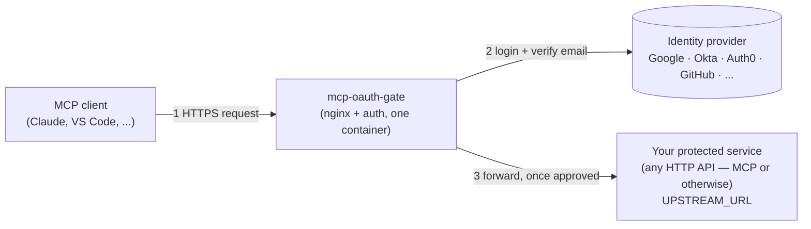
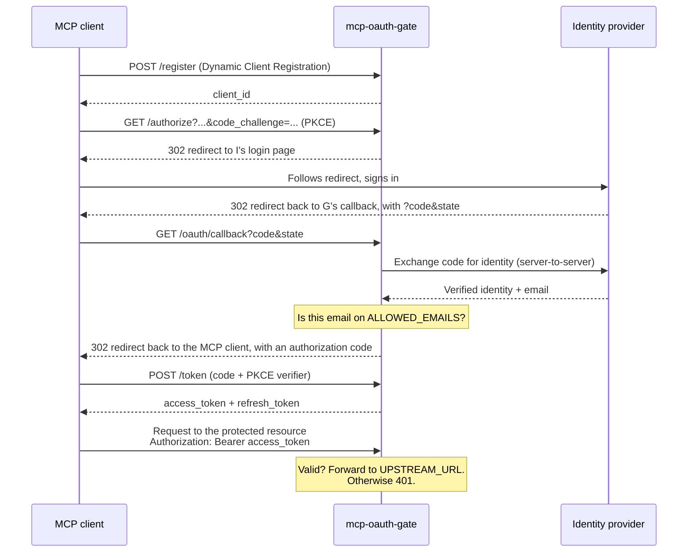

# mcp-oauth-gate

[](https://github.com/sanderBoot0/mcp-oauth-gate/actions/workflows/docker-publish.yml)
[](https://hub.docker.com/r/sanderboot/mcp-oauth-gate)
[](https://hub.docker.com/r/sanderboot/mcp-oauth-gate)
[](./LICENSE.md)

**Put a spec-compliant OAuth 2.1 authorization server in front of any HTTP
service — a [Model Context Protocol (MCP)](https://modelcontextprotocol.io)
server or not — without changing a line of that service's code.**

`mcp-oauth-gate` is a small, self-hostable authorization server, shipped as
a single Docker container with nginx bundled inside, that sits directly in
front of your existing service and handles login, tokens, and access
control for you — so tools like Claude, VS Code, or any other MCP client
can connect with a real "Sign in with Google" (or GitHub, Okta, Auth0,
Keycloak, ...) flow instead of a static bearer token pasted into a config
file. One container to run; no separate reverse proxy to configure.

## The problem this solves

Most self-hosted MCP servers ship with one of two options:

- **No auth at all** — fine on localhost, a liability the moment it's
  reachable from anywhere else.
- **A single static bearer token** — better than nothing, but it's one
  shared secret: no per-device revocation, no expiry, no "who actually
  used this."

Full multi-tenant identity platforms (`oauth2-proxy` and friends) solve
this properly, but they're built for "any number of unrelated users
logging into unrelated apps." If what you actually want is **"let me, and
only me, in — from any of my devices, with a real login screen"**,
that's a lot of machinery for a small job.

`mcp-oauth-gate` is the missing middle: spec-compliant OAuth 2.1
(discovery, Dynamic Client Registration, PKCE, rotating refresh tokens),
gated by a flat allowlist of your own email addresses, checked against an
identity provider you already trust. Single-tenant by design, not
something you grow into by accident.

> Not a competitor to [`oauth2-proxy`](https://github.com/oauth2-proxy/oauth2-proxy) —
> that project is a decade of hardening across thousands of multi-tenant
> deployments. This is a smaller, more opinionated tool for a narrower job.

## How it fits together

`mcp-oauth-gate` bundles nginx internally and reverse-proxies to your
service itself — there's no second container, and no nginx.conf to write.
Point `UPSTREAM_URL` at your service, and every request either gets
checked against a valid token and forwarded, or redirected into the login
flow.



## What actually happens when a client connects

The first time an MCP client connects, it registers itself, sends the
user through a real login screen, and exchanges the result for a token —
all standard OAuth 2.1, so any MCP client that already speaks OAuth just
works. It gets there by fetching this gateway's `/.well-known/oauth-*`
metadata — the same machine-readable discovery documents an automated
client (human-driven or agent-driven) uses to configure itself without a
human reading any docs first.



This authorization-code flow's access token expires after 1 hour by
default; the client silently exchanges its refresh token for a new pair
before then — no re-login. Every refresh rotates the token and revokes the
old one; if a spent refresh token is ever replayed, the entire chain
descended from that login is revoked immediately, not just the reused
token.

There's also a device-code flow for clients that don't speak OAuth
discovery — the same "go to this URL, enter this code" pattern as
`gh auth login`, and inspired by RFC 8628's UX, but it's a custom wire
protocol, not a conformant implementation of that RFC (different endpoint
shape and parameters — see the table below). It isn't advertised in the
discovery metadata (only `authorization_code` and `refresh_token` are), so
a client has to already know about `/device/code` and `/device/token`
rather than discovering it automatically. Its tokens also behave
differently: they don't expire and
there's no refresh token — revoke one by hand if a device is compromised
(against the running container, so it hits the actual database rather
than an unrelated local file):

```sh
docker exec <container-name> node dist/scripts/tokens.js list
docker exec <container-name> node dist/scripts/tokens.js revoke <id>
```

## Standards implemented

Built on the [OAuth 2.1 Authorization Framework](https://datatracker.ietf.org/doc/html/draft-ietf-oauth-v2-1)
(an active IETF draft — no client secrets for public clients, PKCE
mandatory, no implicit grant), plus these finalized RFCs:

| RFC                                                | Title                                   | Used for                                                                                    |
| -------------------------------------------------- | --------------------------------------- | ------------------------------------------------------------------------------------------- |
| [RFC 6749](https://www.rfc-editor.org/rfc/rfc6749) | The OAuth 2.0 Authorization Framework   | The `authorization_code` and `refresh_token` grants                                         |
| [RFC 7636](https://www.rfc-editor.org/rfc/rfc7636) | Proof Key for Code Exchange (PKCE)      | `S256` challenge/verifier on `/authorize` and `/token`                                      |
| [RFC 7591](https://www.rfc-editor.org/rfc/rfc7591) | Dynamic Client Registration Protocol    | `POST /register`                                                                            |
| [RFC 8414](https://www.rfc-editor.org/rfc/rfc8414) | OAuth 2.0 Authorization Server Metadata | `/.well-known/oauth-authorization-server`                                                   |
| [RFC 9728](https://www.rfc-editor.org/rfc/rfc9728) | OAuth 2.0 Protected Resource Metadata   | `/.well-known/oauth-protected-resource`, the `WWW-Authenticate: resource_metadata=...` hint |

There's also a `/device/code` + `/device/token` fallback flow for clients
that don't speak OAuth discovery, in the same spirit as
[RFC 8628](https://www.rfc-editor.org/rfc/rfc8628) (Device Authorization
Grant) — but it's a custom, proprietary wire protocol, not a conformant
implementation of that RFC: it uses different parameter names and a
bespoke polling endpoint rather than the standard `/token` endpoint with
`grant_type=urn:ietf:params:oauth:grant-type:device_code`. A real RFC
8628 client library will not interoperate with it as-is.

The metadata endpoints (RFC 8414, RFC 9728) are what let an MCP client —
or an AI agent driving one — discover how to authenticate against a given
deployment entirely on its own, with no human-written setup instructions
in the loop.

## Is this the right tool?

|                                                         | No auth | Static bearer token | **mcp-oauth-gate** | `oauth2-proxy` |
| ------------------------------------------------------- | ------- | ------------------- | ------------------ | -------------- |
| Real login (not a shared secret)                        | ❌      | ❌                  | ✅                 | ✅             |
| Per-device tokens, individually revocable               | ❌      | ❌                  | ✅                 | ✅             |
| Works with any OIDC provider or GitHub                  | —       | —                   | ✅                 | ✅             |
| MCP-native (OAuth discovery, DCR, device-code fallback) | —       | —                   | ✅                 | ❌             |
| Multi-tenant / per-user authorization                   | —       | —                   | ❌ (by design)     | ✅             |
| Setup effort                                            | none    | trivial             | **small**          | significant    |

If you need real multi-tenancy — different users with different
permissions — use `oauth2-proxy` or a full identity platform instead.
If you're protecting something that's yours, reached from more than one
device, and you want a real login instead of a token in an env var, this
is built for exactly that.

## Quickstart

The fastest way to see it working end to end: the gateway and a
placeholder protected service (`httpbin`) standing in for your real one.
This is the actual, verified content of
[`examples/docker-compose`](./examples/docker-compose) — copy both files
as-is to try it, or adapt inline.

**`docker-compose.yml`:**

```yaml
services:
    mcp-oauth-gate:
        image: sanderboot/mcp-oauth-gate:latest
        restart: unless-stopped
        environment:
            BASE_URL: ${BASE_URL}
            RESOURCE_URL: ${RESOURCE_URL}
            UPSTREAM_URL: ${UPSTREAM_URL}
            AUTH_PROVIDER: ${AUTH_PROVIDER}
            OIDC_ISSUER_URL: ${OIDC_ISSUER_URL:-}
            TRUSTED_PROXY_CIDR: ${TRUSTED_PROXY_CIDR:-}
            CLIENT_ID: ${CLIENT_ID}
            CLIENT_SECRET: ${CLIENT_SECRET}
            ALLOWED_EMAILS: ${ALLOWED_EMAILS}
            DB_PATH: /data/tokens.db
        volumes:
            - gate-data:/data
        ports:
            - '8080:80'
        networks: [internal]
        healthcheck:
            test: ['CMD', 'wget', '-qO-', 'http://127.0.0.1/healthz']
            interval: 30s
            timeout: 5s
            retries: 3

    # Replace this with your real protected service. It just needs to be
    # reachable on the `internal` network at the hostname UPSTREAM_URL
    # points to (`protected-service`, below).
    protected-service:
        image: kennethreitz/httpbin
        restart: unless-stopped
        networks: [internal]

networks:
    internal:

volumes:
    gate-data:
```

**`.env`** (see [`.env.example`](./examples/docker-compose/.env.example)
for the full annotated version):

```sh
BASE_URL=http://localhost:8080
RESOURCE_URL=http://localhost:8080/mcp
UPSTREAM_URL=http://protected-service:80

AUTH_PROVIDER=oidc
OIDC_ISSUER_URL=https://accounts.google.com
CLIENT_ID=
CLIENT_SECRET=

ALLOWED_EMAILS=
```

Fill in `CLIENT_ID`/`CLIENT_SECRET` with an OAuth app registered with
your identity provider (redirect URI `${BASE_URL}/oauth/callback`, i.e.
`http://localhost:8080/oauth/callback` for this example), and `ALLOWED_EMAILS`
with a comma-separated list of who's allowed in — an empty allowlist
means nobody can authenticate. Then:

```sh
docker compose up -d
```

An unauthenticated request to the protected resource is rejected with a
pointer to how to authenticate — this is what an MCP client's OAuth
discovery sees on first contact:

```console
$ curl -i http://localhost:8080/mcp
HTTP/1.1 401 Unauthorized
WWW-Authenticate: Bearer resource_metadata="http://localhost:8080/.well-known/oauth-protected-resource"
```

An MCP client that speaks OAuth discovery takes it from here on its own
(that's what the `resource_metadata` URL above is for). To sign in by hand
instead — the same device-code flow a CLI tool like `gh auth login` uses —
request a code and open the URL it gives you:

```console
$ curl -s -X POST http://localhost:8080/device/code
{"device_code":"...","user_code":"F6DP-Y74K","verification_uri_complete":"http://localhost:8080/device?user_code=F6DP-Y74K", ...}
```

Open `verification_uri_complete` in a browser and sign in through your
identity provider. Meanwhile, poll for the token with the `device_code`
from that response — this returns `{"error":"authorization_pending"}`
until you approve it in the browser, then an access token:

```console
$ curl -s -X POST http://localhost:8080/device/token -d '{"device_code":"..."}' -H 'Content-Type: application/json'
{"access_token":"...","token_type":"Bearer","device_name":"unnamed-device"}
```

That token is what makes a request to the protected resource succeed —
your real MCP server would answer at `/mcp`; the placeholder `httpbin` in
this quickstart doesn't implement that route, so hit one it does have to
see the 200 (the auth check applies identically either way, to any path):

```console
$ curl -i http://localhost:8080/get -H 'Authorization: Bearer <access_token>'
HTTP/1.1 200 OK
```

If you already have a reverse proxy in front for TLS termination or to
consolidate several services, see
[`docs/reverse-proxy.md`](./docs/reverse-proxy.md) — it's a plain reverse
proxy to this container, nothing gateway-specific to configure there.

## Putting this in front of your own MCP server

The Quickstart above uses `httpbin` as a stand-in for your real service.
Swapping it out is three changes, none of them in your MCP server's own
code:

1. **Run your MCP server reachable from the gateway.** Simplest as
   another service on the same `docker-compose` network — it doesn't need
   a `ports:` mapping of its own, only `mcp-oauth-gate` needs to reach it:

    ```yaml
    services:
        mcp-oauth-gate:
            # ... unchanged from the quickstart above ...

        my-mcp-server:
            image: your-org/your-mcp-server:latest
            restart: unless-stopped
            networks: [internal]
    ```

    It doesn't have to be a sibling container — any address the gateway's
    container can reach over plain HTTP works (the bundled nginx rejects
    an `https://` `UPSTREAM_URL` outright — see step 2), including a
    service on the host or another machine entirely. To reach a service on
    the Docker host from Linux, `host.docker.internal` isn't predefined
    the way it is on Docker Desktop — add
    `extra_hosts: ["host.docker.internal:host-gateway"]` to the
    `mcp-oauth-gate` service, and make sure that host service is bound to
    `0.0.0.0` (or the Docker bridge interface), not just `127.0.0.1`,
    which containers can't reach.

    **If your MCP server is on another machine, that hop has to stay on a
    trusted private network (a VPN, [Tailscale](#making-it-publicly-reachable-with-tailscale-optional),
    or an isolated LAN) — never plain HTTP across the open internet or an
    untrusted network.** The gateway passes the client's bearer token and
    the request/response bodies through to `UPSTREAM_URL` as-is — it
    doesn't strip or re-encrypt them — so over plain HTTP both are
    plaintext on that network hop, readable to anyone on the path. This
    isn't specific to a remote machine — the same is true reaching any
    upstream over plain HTTP — it's just a real risk once that hop leaves
    your own host or LAN. (Some request headers _are_ rewritten in
    transit — `Connection` is cleared and an `X-Device-Name` header is
    injected, see below — but the token and payload aren't among them.)

2. **Point `UPSTREAM_URL` at it** — scheme, host, and port only, and
   `http://` specifically: the gateway doesn't support an HTTPS upstream
   yet (`docker/docker-entrypoint.sh` rejects `https://` outright, since
   SNI and certificate verification aren't configured for it):

    ```sh
    UPSTREAM_URL=http://my-mcp-server:3000
    ```

    The gateway forwards the client's original request path unchanged, so
    it doesn't need to know in advance whether your server's MCP endpoint
    lives at `/mcp`, `/`, or anywhere else — whatever path the client
    requested is what your server sees.

3. **Set `RESOURCE_URL` to the full external URL clients will actually
   connect to** — the exact address, path included, that you'll give
   your MCP client. This is returned as the `resource` field from
   `/.well-known/oauth-protected-resource` (the metadata endpoint an
   unauthenticated request's `WWW-Authenticate` header points a client
   at, via `resource_metadata="${BASE_URL}/.well-known/oauth-protected-resource"`
   — the header itself carries that metadata URL, not `RESOURCE_URL`
   directly), so it has to match:

    ```sh
    RESOURCE_URL=https://gateway.example.com/mcp
    ```

    If your server answers at the root path instead, use
    `https://gateway.example.com` — `RESOURCE_URL` just needs to match
    wherever your server's real endpoint is, it isn't required to end in
    `/mcp`.

Point your MCP client at `RESOURCE_URL` and you're done — **the gateway
is the entire protection boundary**: every request that reaches your
server has already been checked against a valid token, and your server
doesn't need to do anything else to enforce that.

The gateway also injects an `X-Device-Name` header naming which device
made the request (the name given during the device-code flow, or
`oauth:<client name>` for a client that registered via standard OAuth),
if your server wants it for logging or per-device behavior. Treat it as
**untrusted, informational metadata, not part of the protection
boundary** — the device-code name comes from client-supplied input at
token-issuance time, so it's not sanitized against your server's own
assumptions (don't use it for access-control decisions, and escape it
before rendering it anywhere).

## Running it yourself

Copy `.env.example` to `.env` and fill in:

| Variable                      | Description                                                                                                                                                                               |
| ----------------------------- | ----------------------------------------------------------------------------------------------------------------------------------------------------------------------------------------- |
| `BASE_URL`                    | Public URL this gateway is reached at                                                                                                                                                     |
| `RESOURCE_URL`                | Canonical URI of the protected resource being guarded                                                                                                                                     |
| `UPSTREAM_URL`                | Internal address of the service being protected — scheme+host+port only, e.g. `http://mcp-server:3000` (no path: the original request path is forwarded unchanged)                        |
| `AUTH_PROVIDER`               | `oidc` (any OIDC-compliant provider) or `github`                                                                                                                                          |
| `OIDC_ISSUER_URL`             | Issuer base URL (only when `AUTH_PROVIDER=oidc`), e.g. `https://accounts.google.com`                                                                                                      |
| `CLIENT_ID` / `CLIENT_SECRET` | OAuth app credentials from the identity provider                                                                                                                                          |
| `ALLOWED_EMAILS`              | Comma-separated allowlist of verified emails — this _is_ your entire access-control list                                                                                                  |
| `DB_PATH`                     | SQLite path (default `/data/tokens.db`)                                                                                                                                                   |
| `TRUSTED_PROXY_CIDR`          | Optional — only if you put another reverse proxy in front (see [`docs/reverse-proxy.md`](./docs/reverse-proxy.md)); its IP/CIDR, so rate limiting sees real clients instead of that proxy |

The redirect/callback URL registered with your identity provider must be
exactly `${BASE_URL}/oauth/callback`.

```sh
docker run --env-file .env -p 80:80 -v gate-data:/data sanderboot/mcp-oauth-gate
```

Published images: [`sanderboot/mcp-oauth-gate`](https://hub.docker.com/r/sanderboot/mcp-oauth-gate)
on Docker Hub (multi-arch: `linux/amd64`, `linux/arm64`). Or build it
yourself — tag it the same as above so the `docker run` command actually
runs what you just built rather than pulling the published image:
`docker build -t sanderboot/mcp-oauth-gate .`

## Making it publicly reachable with Tailscale (optional)

If you don't already have a domain, a TLS certificate, and port-forwarding
sorted out, [Tailscale](https://tailscale.com/) is a fast way to get a
real HTTPS URL for this gateway — reachable from your tailnet, and
optionally from the public internet via
[Funnel](https://tailscale.com/kb/1223/funnel) — without opening a single
port on your router. Add a `tailscale` service to the quickstart's
`docker-compose.yml`, and add `ts-state` to its existing `volumes:` block
alongside `gate-data`:

```yaml
services:
    # ... mcp-oauth-gate and protected-service from the quickstart above ...

    tailscale:
        image: tailscale/tailscale:latest
        restart: unless-stopped
        hostname: mcp-gate # this is what becomes <hostname>.<tailnet>.ts.net — deliberately not the same string as the mcp-oauth-gate *service* above, to avoid any ambiguity on the shared Docker network's DNS
        environment:
            TS_AUTHKEY: ${TS_AUTHKEY:-}
            TS_STATE_DIR: /var/lib/tailscale
            TS_USERSPACE: 'false'
        volumes:
            - ts-state:/var/lib/tailscale
        devices:
            - /dev/net/tun
        cap_add:
            - NET_ADMIN
            - NET_RAW
        networks: [internal]
        depends_on: [mcp-oauth-gate]

volumes:
    gate-data:
    ts-state:
```

The resulting hostname is deterministic —
`https://<hostname>.<your-tailnet-name>.ts.net`, `mcp-gate` for
`<hostname>` per the config above, and `<your-tailnet-name>` is whatever
your tailnet is already called (visible in the
[admin console](https://login.tailscale.com/admin/machines), or via
`tailscale status` on any device already joined to it) — so you can know
the final URL before ever starting this stack, rather than discovering it
after the fact and having to restart everything. Set that in `.env`
**before** bringing the stack up:

```sh
BASE_URL=https://mcp-gate.<your-tailnet-name>.ts.net
RESOURCE_URL=https://mcp-gate.<your-tailnet-name>.ts.net/mcp
```

and register that same host as your identity provider's OAuth callback
(`${BASE_URL}/oauth/callback`). Then generate an auth key from the
[Tailscale admin console](https://login.tailscale.com/admin/settings/keys),
set `TS_AUTHKEY` in `.env` too, bring the stack up, and run this **once**
from the host (`--bg` persists it in `tailscaled`'s own state, so it
survives container restarts without re-running):

```sh
docker compose up -d
docker compose exec tailscale tailscale serve --bg --https=443 http://mcp-oauth-gate:80
```

That alone makes the gateway reachable at
`https://mcp-gate.<your-tailnet-name>.ts.net` from any device on your
tailnet. To also make it reachable from the public internet, enable
Funnel for this node in the Tailscale admin console first, then:

```sh
docker compose exec tailscale tailscale funnel --bg --https=443 http://mcp-oauth-gate:80
```

`funnel` takes the real backend as its own target, same as `serve`
above — it does **not** layer on top of an existing `serve` config via a
`localhost:443` reference. That looks plausible from the CLI's own docs
but proxies to nothing, since nothing listens on `localhost:443` inside
the `tailscale` container itself.

## Security model

Before deploying this for anything real, read
[`docs/security-model.md`](./docs/security-model.md) — it states the
single-tenant assumption plainly, explains why Dynamic Client Registration
is intentionally unauthenticated (and why that's safe _only_ under the
allowlist-gated model), and lists what this gateway explicitly does not
defend against: multi-tenancy; WAF/DDoS protection beyond a basic default
rate limit; and audit logging (token issuance/revocation isn't shipped
anywhere — bring your own log aggregation if you need a record of it).

## Contributing

Building or modifying `mcp-oauth-gate` itself (running the test suite,
linting, CI/CD internals, the Dependabot setup) is covered in
[`CONTRIBUTING.md`](./CONTRIBUTING.md). See [`plan.md`](./plan.md) for the
project's phases and open decisions.
